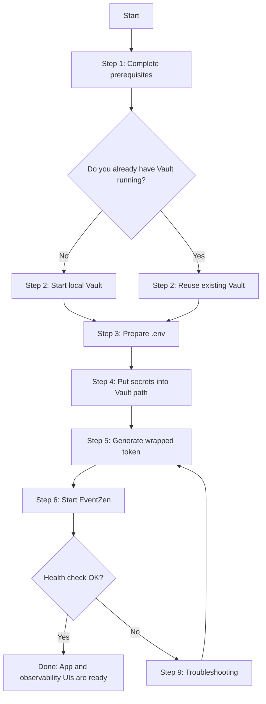

# EventZen Getting Started

This is the fastest, most explicit setup guide for running EventZen locally with Docker and Vault.

If you follow this document top to bottom, you should get a working stack on first run.

## Runtime Model (Important)

EventZen startup is Vault-first:

1. Secrets live in Vault at one shared KV path.
2. You provide one wrapped token in `.env` (`VAULT_WRAPPED_SECRET_ID`).
3. Startup unwraps once and shares a short-lived runtime token through an internal volume.
4. App services load secrets from Vault at boot.

No local runtime secret file is required.

## Quick Path (Recommended)

If Vault is already running and populated, this is enough:

1. Copy `.env.example` to `.env`.
2. Ensure Vault values in `.env` are correct.
3. Run:

```powershell
./scripts/start-local.ps1
```

That helper generates a fresh wrapped token and starts the stack.

## Setup Flow (Do This In Order)



## Full Setup (From Zero)

## 1) Prerequisites

Mini steps:

1. Confirm Docker Desktop is running.
2. Confirm Docker Compose v2 is available.
3. Confirm Vault server is available (or prepare to start local dev Vault in Step 2).
4. Install Vault CLI for easier setup and debugging.

Required:

- Docker Desktop running
- Docker Compose v2
- Vault server running
- Vault CLI (recommended)

Accounts and credentials you should prepare before startup:

- Google account for SMTP OTP delivery (`SMTP_USER`, `SMTP_PASS`)
- Polar sandbox account for payments (`POLAR_ACCESS_TOKEN`, `POLAR_PRODUCT_ID`)
- Strong app secrets (`JWT_SECRET`, `INTERNAL_SERVICE_SECRET`, `TOKEN_HASH_SECRET`)
- Local infra/admin passwords (`MYSQL_ROOT_PASSWORD`, `MINIO_ROOT_PASSWORD`, `GRAFANA_ADMIN_PASSWORD`)

How to prepare each prerequisite credential:

1. Gmail SMTP app password (required for OTP emails)
   1. Use a Gmail account for `SMTP_USER`.
   2. Enable Google 2-Step Verification on that account.
   3. Open App Passwords: https://myaccount.google.com/apppasswords
   4. Generate a 16-character app password and use it as `SMTP_PASS`.
   5. Do not use your normal Gmail login password.

2. Polar test API key and product ID (required for paid checkout)
   1. Log in to Polar and switch to Sandbox/Test mode.
   2. Create a product that represents your EventZen checkout item.
   3. Create a personal/org access token in Polar dashboard developer settings and use it as `POLAR_ACCESS_TOKEN`.
   4. Copy the created product id and use it as `POLAR_PRODUCT_ID`.

3. Generate strong secrets for JWT/internal signing
   1. Generate values with PowerShell:

```powershell
[Convert]::ToBase64String((1..48 | ForEach-Object { Get-Random -Maximum 256 }))
```

   2. Generate separate values for:
   - `JWT_SECRET`
   - `INTERNAL_SERVICE_SECRET`
   - `TOKEN_HASH_SECRET`

4. Keep `.env` and Vault values aligned
   1. Root `.env` holds infrastructure/runtime wiring values.
   2. Vault path `secret/eventzen/ez-secrets` holds app secrets consumed at boot.
   3. Use `vault-secrets.example.json` as the source-of-truth key list for Vault.

Install Vault CLI (Windows):

```powershell
winget install HashiCorp.Vault
```

or

```powershell
choco install vault
```

Verify tools:

```powershell
docker --version
docker compose version
vault --version
```

## 2) Start Vault (Skip if you already have one)

Mini steps:

1. Start Vault.
2. Point local Vault CLI to it.
3. Verify host and container network reachability.
4. Verify token login and KV mount access before moving forward.

Choose one mode:

- Mode A: Dockerized Vault (container)
- Mode B: External Vault process on this same machine (non-Docker)

Quick local Vault container:

```powershell
docker run --name eventzen-vault -d --cap-add=IPC_LOCK -e VAULT_DEV_ROOT_TOKEN_ID=root-dev-token -e VAULT_DEV_LISTEN_ADDRESS=0.0.0.0:8200 -p 8200:8200 hashicorp/vault:1.16
```

External Vault process on host (Windows PowerShell):

```powershell
vault server -dev -dev-root-token-id="root-dev-token" -dev-listen-address="0.0.0.0:8200"
```

Keep that terminal running while you work.

Configure CLI environment:

```powershell
$env:VAULT_ADDR = "http://127.0.0.1:8200"
$env:VAULT_TOKEN = "root-dev-token"
vault status
```

If you are using external Vault on a different host port, update both values:

```dotenv
VAULT_ADDR=http://127.0.0.1:<your-port>
VAULT_DOCKER_ADDR=http://host.docker.internal:<your-port>
```

If the container already exists but is stopped:

```powershell
docker start eventzen-vault
```

If you get `connectex: actively refused` on port 8200:

1. Start Docker Desktop first.
2. Re-run `docker start eventzen-vault` or the `docker run ...` command above.
3. Re-check with `vault status`.

Verify containers can reach Vault:

```powershell
docker run --rm curlimages/curl:8.12.1 curl -fsS http://host.docker.internal:8200/v1/sys/health
```

For a custom external Vault port, replace `8200` in the command above.

Verify Vault token and KV visibility:

```powershell
vault token lookup
vault secrets list
vault kv list secret/
```

## 3) Prepare .env

Mini steps:

1. Copy `.env.example` into `.env`.
2. Fill Vault topology values first.
3. Fill infra/admin values.
4. Keep wrapped token empty for now.

Copy template:

```powershell
Copy-Item .env.example .env
```

Set at least these values in `.env`:

- `VAULT_ADDR=http://127.0.0.1:8200`
- `VAULT_DOCKER_ADDR=http://host.docker.internal:8200`
- `VAULT_SKIP_TLS_VERIFY=true`
- `VAULT_KV_MOUNT=secret`
- `VAULT_KV_PATH=eventzen/ez-secrets`
- `EZ_VAULT_WRAP_PATH=auth/token/create`
- `VAULT_WRAPPED_SECRET_ID=` (leave blank for now)
- `MYSQL_ROOT_PASSWORD=...`
- `MINIO_ROOT_USER=...`
- `MINIO_ROOT_PASSWORD=...`
- `GRAFANA_ADMIN_USER=...`
- `GRAFANA_ADMIN_PASSWORD=...`

Host tooling ports are configurable in `.env` if needed:

- `MONGO_HOST_PORT`
- `MYSQL_HOST_PORT`
- `MINIO_API_HOST_PORT`
- `MINIO_CONSOLE_HOST_PORT`
- `KAFKA_HOST_PORT`
- `PROMETHEUS_HOST_PORT`
- `GRAFANA_HOST_PORT`

## 4) Put Secrets Into Vault

Mini steps:

1. Ensure KV v2 mount exists at `secret`.
2. Open path `eventzen/ez-secrets`.
3. Copy every key from `vault-secrets.example.json`.
4. Save and re-check key spelling.
5. Read back the path to confirm data is written.

Use `vault-secrets.example.json` as the required key list.

Create KV mount if needed:

```powershell
vault secrets enable -path=secret kv-v2
```

Then in Vault UI:

1. Open KV v2 mount `secret`.
2. Create or edit path `eventzen/ez-secrets`.
3. Add all keys from `vault-secrets.example.json` with real values.

CLI option (faster): load JSON file directly into Vault path

```powershell
vault kv put -mount=secret eventzen/ez-secrets @vault-secrets.example.json
```

Recommended safer workflow (do not edit example in place):

```powershell
Copy-Item .\vault-secrets.example.json .\vault-secrets.local.json
notepad .\vault-secrets.local.json
vault kv put -mount=secret eventzen/ez-secrets @vault-secrets.local.json
```

Verify stored values:

```powershell
vault kv get -mount=secret eventzen/ez-secrets
```

Rules:

- Key names must match exactly.
- Missing keys can cause service startup failure.
- Keep mirrored keys aligned where applicable (for example, `JWT_SECRET` and `JWT__Secret`).

## 5) Generate Wrapped Token

Mini steps:

1. Generate a fresh wrapped token.
2. Write it to `.env` (`VAULT_WRAPPED_SECRET_ID`).
3. Start compose before token expiry.

Option A (manual output):

```powershell
./scripts/generate-vault-wrapped-token.ps1
```

Copy the printed value into `.env`:

```dotenv
VAULT_WRAPPED_SECRET_ID=<wrapped-token>
```

Option B (auto-write into `.env`):

```powershell
./scripts/generate-vault-wrapped-token.ps1 -UpdateEnv
```

Rules:

- Wrapped token is single-use.
- Wrapped token expires.
- Generate a fresh one before each manual `docker compose up`.

## 6) Start EventZen

Mini steps:

1. Prefer `./scripts/start-local.ps1` for first run.
2. Wait until backend health checks pass.
3. Confirm gateway starts last.

Preferred helper:

```powershell
./scripts/start-local.ps1
```

Manual startup:

```powershell
docker compose up --build
```

What startup does:

1. `vault-preflight` checks Vault reachability.
2. `vault-secrets-init` validates and unwraps your wrapped token.
3. Shared runtime token is written to internal volume.
4. Node, Spring, and .NET read Vault secrets and start.
5. Gateway starts after backend healthchecks pass.

## 7) Verify

Mini steps:

1. Hit `/health` through gateway.
2. Confirm key containers are healthy.
3. Open app and observability UIs.

Health endpoint:

```powershell
curl.exe -fsS http://localhost:8080/health
```

Container status:

```powershell
docker compose ps
```

Expected key services:

- `node-service` healthy
- `spring-service` healthy
- `dotnet-service` healthy
- `nginx-gateway` up

Useful UIs:

- App: http://localhost:8080
- Swagger UI: http://localhost:8080/swagger/
- OpenAPI YAML: http://localhost:8080/openapi/eventzen-aggregated.yaml
- Grafana: http://localhost:3000
- Prometheus: http://localhost:9090
- MinIO Console: http://localhost:9001

Quick API test asset:

- Root Postman collection: `EventZen_Full_Application.postman_collection.json`

## 8) Stop / Reset

Stop everything:

```powershell
docker compose down
```

Stop and remove volumes:

```powershell
docker compose down -v
```

After `down -v`, generate a fresh wrapped token for next run.

## 9) Troubleshooting

Get focused startup logs:

```powershell
docker compose logs --no-color --tail=200 vault-secrets-init user-seed node-service spring-service dotnet-service nginx-gateway
```

Common failure: wrapped token invalid

- Error: `vault-secrets-init: wrapping lookup failed: wrapping token is not valid or does not exist`
- Meaning: token missing, expired, already consumed, or mismatched path
- Fix:
1. Generate a fresh wrapped token
2. Ensure `EZ_VAULT_WRAP_PATH=auth/token/create`
3. Retry startup

Common failure: Vault not reachable from containers

- Check `VAULT_DOCKER_ADDR`
- Validate with:

```powershell
docker run --rm curlimages/curl:8.12.1 curl -fsS http://host.docker.internal:8200/v1/sys/health
```

Common failure: Vault login/token issues

- Check:

```powershell
vault status
vault token lookup
```

- Re-authenticate for local dev container:

```powershell
$env:VAULT_ADDR = "http://127.0.0.1:8200"
vault login root-dev-token
```

Common failure: app services never start

- Usually blocked behind failed `vault-secrets-init`
- Fix Vault issue first, then restart

## 10) Which .env Values Can Be Arbitrary?

Usually arbitrary (valid non-empty values):

- `MYSQL_ROOT_PASSWORD`
- `MINIO_ROOT_USER`
- `MINIO_ROOT_PASSWORD`
- `GRAFANA_ADMIN_USER`
- `GRAFANA_ADMIN_PASSWORD`

Must match real topology/config:

- `VAULT_ADDR`
- `VAULT_DOCKER_ADDR`
- `VAULT_SKIP_TLS_VERIFY`
- `VAULT_KV_MOUNT`
- `VAULT_KV_PATH`
- `EZ_VAULT_WRAP_PATH`
- `VAULT_WRAPPED_SECRET_ID`

## 11) Security Notes

- Never commit `.env`.
- Do not keep long-lived production tokens in `.env`.
- Rotate secrets if exposed.
- For production, replace root-policy workflow with least-privilege Vault policies.

## Optional Helper Flags

`scripts/start-local.ps1`:

- `-Detach` run in background
- `-NoBuild` skip image rebuild
- `-KeepWrappedToken` keep wrapped token in `.env` after startup

## Minimum Success Checklist

1. Vault reachable from host and containers
2. `secret/eventzen/ez-secrets` populated
3. Fresh `VAULT_WRAPPED_SECRET_ID`
4. `docker compose up --build` or `./scripts/start-local.ps1`
5. `http://localhost:8080/health` returns OK