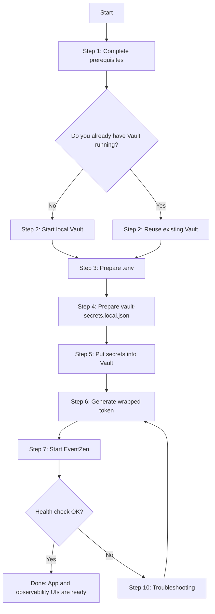

# EventZen Getting Started

This is the complete, step-by-step setup guide for running EventZen locally with Docker and Vault.

If you follow this document top to bottom, you should get a working stack on first run.

> [!NOTE]
> **Linux users:** The setup scripts (`.ps1`) require **PowerShell 7+**.
> Install it before continuing: `sudo snap install powershell --classic`
> or follow the [official guide](https://learn.microsoft.com/en-us/powershell/scripting/install/installing-powershell-on-linux).

---

## Table of Contents

- [Runtime Model](#runtime-model-important)
- [Quick Start Script](#quick-start-script)
- [Quick Path](#quick-path-recommended)
- [Full Setup](#full-setup-from-zero)
  - [1) Prerequisites](#1-prerequisites)
  - [2) Start Vault](#2-start-vault-skip-if-you-already-have-one)
  - [3) Prepare .env](#3-prepare-env)
  - [4) Prepare Vault Secrets](#4-prepare-vault-secrets)
  - [5) Put Secrets Into Vault](#5-put-secrets-into-vault)
  - [6) Generate Wrapped Token](#6-generate-wrapped-token)
  - [7) Start EventZen](#7-start-eventzen)
  - [8) Verify](#8-verify)
  - [9) Stop / Reset](#9-stop--reset)
- [Troubleshooting](#10-troubleshooting)
- [.env Variable Reference](#11-env-variable-reference)
- [Security Notes](#12-security-notes)
- [Minimum Success Checklist](#minimum-success-checklist)

---

## Runtime Model (Important)

EventZen startup is Vault-first:

1. Secrets live in Vault at one shared KV path.
2. You provide one wrapped token in `.env` (`VAULT_WRAPPED_SECRET_ID`).
3. Startup unwraps once and shares a short-lived runtime token through an internal volume.
4. App services load secrets from Vault at boot.

No local runtime secret file is required.

---

## Quick Start Script

Before running quickstart, create your local secrets file and fill real values:

```powershell
Copy-Item .\vault-secrets.example.json .\vault-secrets.local.json
```

Use this single command to bootstrap local Vault setup and start the full app stack:

```powershell
./scripts/quickstart.ps1 -Detach
```

What it handles automatically:

1. Creates `.env` from `.env.example` if missing.
2. Uses your existing `vault-secrets.local.json` (required by default).
3. Starts local Vault dev container (`eventzen-vault`) if needed.
4. Ensures `secret/` KV v2 mount exists.
5. Runs `./scripts/start-local.ps1` to upload local secrets, generate wrapped token, and start Docker Compose.

Optional dev-only fallback if you want auto-generated placeholders:

```powershell
./scripts/quickstart.ps1 -Detach -AllowGeneratedDevSecrets
```

Use this path when you want the fastest setup with minimal manual steps. The manual path below remains fully supported.

---

## Quick Path (Recommended)

If Vault is already running and populated, this is enough:

1. Copy `.env.example` to `.env`.
2. Ensure Vault values in `.env` are correct.
3. Run:

```powershell
./scripts/start-local.ps1
```

That helper generates a fresh wrapped token and starts the stack.

When the stack is up, three **test users are seeded automatically** by Docker Compose:

| Email | Role | Password |
|---|---|---|
| `admin@ez.local` | ADMIN | `Eventzen@2026!` |
| `vendor@ez.local` | VENDOR | `Eventzen@2026!` |
| `user@ez.local` | CUSTOMER | `Eventzen@2026!` |

---

## Setup Flow (Do This In Order)



---

## Full Setup (From Zero)

## 1) Prerequisites

### Required software

| Tool | Why | Check command |
|---|---|---|
| Docker Desktop | Runs all containers | `docker --version` |
| Docker Compose v2 | Orchestrates the full stack | `docker compose version` |
| Vault CLI | Manages secrets, generates wrapped tokens | `vault --version` |

All three commands should return a version number. Install any missing tools before continuing.

### Install Vault CLI

**Windows:**

```powershell
winget install HashiCorp.Vault
# or
choco install vault
```

**Linux:**

```bash
sudo apt-get install -y vault
# or via the HashiCorp repo:
curl -fsSL https://apt.releases.hashicorp.com/gpg | sudo gpg --dearmor -o /usr/share/keyrings/hashicorp-archive-keyring.gpg
echo "deb [signed-by=/usr/share/keyrings/hashicorp-archive-keyring.gpg] https://apt.releases.hashicorp.com $(lsb_release -cs) main" | sudo tee /etc/apt/sources.list.d/hashicorp.list
sudo apt-get update && sudo apt-get install vault
```

### Accounts and credentials to prepare

Before proceeding, you will need the following accounts and credentials ready. Each is explained in detail in [Step 4: Prepare Vault Secrets](#4-prepare-vault-secrets).

| Category | Keys | Required? |
|---|---|---|
| Strong signing secrets | `JWT_SECRET`, `INTERNAL_SERVICE_SECRET`, `TOKEN_HASH_SECRET` | **Yes** — services crash without them |
| Gmail SMTP | `SMTP_HOST`, `SMTP_USER`, `SMTP_PASS` | Optional for dev — emails silently skip if not set |
| Polar.sh payments | `POLAR_ACCESS_TOKEN`, `POLAR_PRODUCT_ID` | Optional — only needed for paid ticket checkout |
| Infrastructure passwords | `MYSQL_ROOT_PASSWORD`, `MINIO_ROOT_PASSWORD`, etc. | **Yes** — pick any non-empty values |

---

## 2) Start Vault (Skip if you already have one)

Choose one mode:

- **Mode A:** Dockerized Vault (container) — recommended for most users
- **Mode B:** External Vault process on this same machine (non-Docker)

### Mode A: Docker container (recommended)

```powershell
docker run --name eventzen-vault -d --cap-add=IPC_LOCK -e VAULT_DEV_ROOT_TOKEN_ID=root-dev-token -e VAULT_DEV_LISTEN_ADDRESS=0.0.0.0:8200 -p 8200:8200 hashicorp/vault:1.16
```

If the container already exists but is stopped:

```powershell
docker start eventzen-vault
```

### Mode B: External Vault process on host

```powershell
vault server -dev -dev-root-token-id="root-dev-token" -dev-listen-address="0.0.0.0:8200"
```

Keep that terminal running while you work.

### Configure CLI environment

```powershell
$env:VAULT_ADDR = "http://127.0.0.1:8200"
$env:VAULT_TOKEN = "root-dev-token"
vault status
```

**Bash equivalent:**

```bash
export VAULT_ADDR="http://127.0.0.1:8200"
export VAULT_TOKEN="root-dev-token"
vault status
```

If you are using a different host port, update both values:

```dotenv
VAULT_ADDR=http://127.0.0.1:<your-port>
VAULT_DOCKER_ADDR=http://host.docker.internal:<your-port>
```

### Troubleshooting Vault startup

If you get `connectex: actively refused` on port 8200:

1. Start Docker Desktop first.
2. Re-run `docker start eventzen-vault` or the `docker run ...` command above.
3. Re-check with `vault status`.

Verify containers can reach Vault:

```powershell
docker run --rm curlimages/curl:8.12.1 curl -fsS http://host.docker.internal:8200/v1/sys/health
```

Verify Vault token and KV visibility:

```powershell
vault token lookup
vault secrets list
vault kv list secret/
```

---

## 3) Prepare .env

Copy template:

```powershell
Copy-Item .env.example .env
```

**Linux/bash:**

```bash
cp .env.example .env
```

Open `.env` and confirm these values:

| Variable | Required Value | Notes |
|---|---|---|
| `VAULT_ADDR` | `http://127.0.0.1:8200` | Your Vault server address from host |
| `VAULT_DOCKER_ADDR` | `http://host.docker.internal:8200` | Container-reachable Vault URL |
| `VAULT_SKIP_TLS_VERIFY` | `true` | Skip TLS for local dev |
| `VAULT_KV_MOUNT` | `secret` | KV v2 mount name |
| `VAULT_KV_PATH` | `eventzen/ez-secrets` | **Must be exactly this path** |
| `EZ_VAULT_WRAP_PATH` | `auth/token/create` | Token wrapping path |
| `VAULT_WRAPPED_SECRET_ID` | *(leave blank for now)* | Auto-filled in Step 6 |
| `MYSQL_ROOT_PASSWORD` | Any non-empty value | Must match `SPRING_DATASOURCE_PASSWORD` in Vault |
| `MINIO_ROOT_USER` | `minioadmin` | Must match `MINIO_ACCESS_KEY` in Vault |
| `MINIO_ROOT_PASSWORD` | `minioadmin` | Must match `MINIO_SECRET_KEY` in Vault |
| `GRAFANA_ADMIN_USER` | `admin` | Grafana dashboard login |
| `GRAFANA_ADMIN_PASSWORD` | `admin` | Grafana dashboard password |
| `POLAR_SERVER` | `sandbox` | `sandbox` for dev, `production` for live |

Host tooling ports are configurable in `.env` if the defaults conflict on your machine:

| Variable | Default | Service |
|---|---|---|
| `MONGO_HOST_PORT` | `27018` | MongoDB |
| `MYSQL_HOST_PORT` | `3307` | MySQL |
| `MINIO_API_HOST_PORT` | `9000` | MinIO API |
| `MINIO_CONSOLE_HOST_PORT` | `9001` | MinIO Console |
| `KAFKA_HOST_PORT` | `9094` | Kafka external |
| `PROMETHEUS_HOST_PORT` | `9090` | Prometheus UI |
| `GRAFANA_HOST_PORT` | `3000` | Grafana UI |

---

## 4) Prepare Vault Secrets

This is the most critical step. Every key in `vault-secrets.example.json` must be present in Vault with correct values. Missing or weak secrets will cause services to crash on startup.

Copy the template:

```powershell
Copy-Item .\vault-secrets.example.json .\vault-secrets.local.json
```

**Linux/bash:**

```bash
cp vault-secrets.example.json vault-secrets.local.json
```

Now open `vault-secrets.local.json` in your editor and fill in every value using the reference below.

> [!CAUTION]
> **`vault-secrets.local.json` contains real secrets. Never commit it to git.** It is already in `.gitignore`.

---

### 4a) Signing secrets — JWT_SECRET, INTERNAL_SERVICE_SECRET, TOKEN_HASH_SECRET

These are HMAC signing keys used across all three backend services.

> [!CAUTION]
> **Strong secrets are mandatory.** The Spring Boot service uses `io.jsonwebtoken.security.Keys.hmacShaKeyFor()` to create the HMAC-SHA256 signing key. This function requires the secret to be **at least 32 bytes (256 bits)** when encoded as UTF-8. If the secret is shorter, Spring Boot will throw a `WeakKeyException` and **crash immediately on startup**. The .NET service has a similar requirement via `SymmetricSecurityKey`.
>
> In practice, generate a **base64 string of 48+ random bytes** (which produces a 64-character string). This satisfies all three services and provides a good security margin.

**How to generate:**

Run the command below **three separate times** to get three unique values:

**PowerShell (Windows/Linux):**
```powershell
[Convert]::ToBase64String((1..48 | ForEach-Object { Get-Random -Maximum 256 }))
```

**Bash (Linux/Mac):**
```bash
openssl rand -base64 48
```

Each command outputs a 64-character base64 string. Use one for each key:

| Key in vault-secrets.local.json | What it does | Which services use it |
|---|---|---|
| `JWT_SECRET` | Signs and verifies JWT access tokens (15-min TTL) | Node.js (issuer), Spring Boot (verifier), .NET (verifier via `JWT__Secret`) |
| `INTERNAL_SERVICE_SECRET` | Authenticates service-to-service internal API calls via `X-Internal-Secret` header | Node.js, Spring Boot, .NET (via `Spring__InternalSecret` and `Node__InternalSecret`) |
| `TOKEN_HASH_SECRET` | HMAC key for hashing OTP codes and password-reset tokens before storing them in MongoDB | Node.js only |

> [!WARNING]
> **Do not reuse the same value for all three keys.** If one key is compromised, the others remain secure if they are different values.

---

### 4b) Mirrored keys — JWT__Secret, Spring__InternalSecret, Node__InternalSecret

The .NET service reads configuration using ASP.NET's `__` (double underscore) convention for section separators. These keys must be **exact copies** of their counterparts:

| Key | Must equal |
|---|---|
| `JWT__Secret` | Same value as `JWT_SECRET` |
| `Spring__InternalSecret` | Same value as `INTERNAL_SERVICE_SECRET` |
| `Node__InternalSecret` | Same value as `INTERNAL_SERVICE_SECRET` |

> [!IMPORTANT]
> If these values don't match, the .NET budget service will fail to verify JWT tokens or fail to authenticate with the Node/Spring internal APIs. You'll see `401 Unauthorized` errors in cross-service calls.

---

### 4c) Gmail SMTP — SMTP_HOST, SMTP_USER, SMTP_PASS

EventZen sends emails for:
- OTP verification during registration
- Password reset links
- Event notifications to attendees

| Key | Value |
|---|---|
| `SMTP_HOST` | `smtp.gmail.com` |
| `SMTP_USER` | Your Gmail address (e.g. `you@gmail.com`) |
| `SMTP_PASS` | A 16-character **Google App Password** |

> [!WARNING]
> **You cannot use your normal Gmail login password.** Google blocks SMTP login with regular passwords. You must generate a dedicated App Password.

**Step-by-step setup:**

1. **Enable 2-Step Verification** on your Google account:
   - Go to https://myaccount.google.com/security
   - Under "How you sign in to Google", click "2-Step Verification"
   - Follow the prompts to enable it (if not already enabled)

2. **Generate an App Password:**
   - Go to https://myaccount.google.com/apppasswords
   - You may need to re-enter your password
   - Under "Select app", choose "Mail"
   - Under "Select device", choose your device or "Other (Custom name)" and type "EventZen"
   - Click "Generate"
   - Google will show a **16-character password** (formatted as four groups of four letters)
   - Copy the full 16-character password (without spaces) and paste it as `SMTP_PASS`

3. **Set the values in `vault-secrets.local.json`:**
   ```json
   "SMTP_HOST": "smtp.gmail.com",
   "SMTP_USER": "your.actual.email@gmail.com",
   "SMTP_PASS": "abcdefghijklmnop"
   ```

> [!TIP]
> **SMTP is optional for local development.** If `SMTP_HOST`, `SMTP_USER`, or `SMTP_PASS` are missing or empty, the Node.js service will log a warning and silently skip sending emails. OTP verification and password reset will not work, but all other features will function normally. You can still log in with the seeded test users.

---

### 4d) Polar.sh — POLAR_ACCESS_TOKEN, POLAR_PRODUCT_ID

EventZen uses [Polar.sh](https://polar.sh) as its payment processor for paid ticket checkout. Polar provides a sandbox mode for development.

| Key | Value |
|---|---|
| `POLAR_ACCESS_TOKEN` | A personal or organization API access token from Polar |
| `POLAR_PRODUCT_ID` | The UUID of a product you create in Polar's dashboard |

> [!TIP]
> **Polar is optional for local development.** If these values are missing or empty, only **free ticket** registration will work. Attempting to check out a paid ticket will return a `503 Service Unavailable` error with the message "Paid checkout is not configured."

**Step-by-step setup:**

1. **Create an account:**
   - Go to https://polar.sh and sign up (GitHub sign-in works)

2. **Switch to Sandbox mode:**
   - In the Polar dashboard, switch to **Sandbox/Test** environment
   - This gives you a separate test workspace where no real money is involved

3. **Create an Organization** (if you don't have one):
   - Go to your dashboard and create an org

4. **Create a Product:**
   - In Sandbox mode, go to **Products**
   - Create a new product (e.g. name it "EventZen Ticket")
   - Set any placeholder price (the actual price is overridden per-checkout via ad-hoc pricing)
   - After creating it, **copy the Product ID** (a UUID shown in the product details or URL)

5. **Create a Personal Access Token:**
   - Go to **Settings** > **Developers** > **Personal Access Tokens**
   - Click "New Token"
   - Give it a descriptive name (e.g. "EventZen Dev")
   - Grant it permissions for checkouts and orders
   - Click "Create" and **copy the token immediately** (it won't be shown again)

6. **Set the values in `vault-secrets.local.json`:**
   ```json
   "POLAR_ACCESS_TOKEN": "polar_oat_xxxxxxxxxxxxxxxxxxxx",
   "POLAR_PRODUCT_ID": "xxxxxxxx-xxxx-xxxx-xxxx-xxxxxxxxxxxx"
   ```

> [!NOTE]
> The `.env` file has a `POLAR_SERVER` variable (default: `sandbox`). This controls whether the Node.js PaymentService talks to Polar's sandbox API (`https://sandbox-api.polar.sh/v1`) or the production API (`https://api.polar.sh/v1`). For local development, always keep it set to `sandbox`.

---

### 4e) Database and infrastructure passwords

| Key | Default | What it controls | Alignment rule |
|---|---|---|---|
| `SPRING_DATASOURCE_PASSWORD` | *(none)* | MySQL connection password for Spring Boot | **Must equal** `MYSQL_ROOT_PASSWORD` in `.env` |
| `MYSQL_ROOT_PASSWORD` | *(none)* | MySQL container root password | **Must equal** `SPRING_DATASOURCE_PASSWORD` in Vault |
| `MINIO_ACCESS_KEY` | `minioadmin` | MinIO S3 access key for Node.js uploads | **Must equal** `MINIO_ROOT_USER` in `.env` |
| `MINIO_SECRET_KEY` | `minioadmin` | MinIO S3 secret key for Node.js uploads | **Must equal** `MINIO_ROOT_PASSWORD` in `.env` |
| `MINIO_ROOT_USER` | `minioadmin` | MinIO container admin user | **Must equal** `MINIO_ACCESS_KEY` in Vault |
| `MINIO_ROOT_PASSWORD` | `minioadmin` | MinIO container admin password | **Must equal** `MINIO_SECRET_KEY` in Vault |
| `GRAFANA_ADMIN_USER` | `admin` | Grafana dashboard login | No alignment needed |
| `GRAFANA_ADMIN_PASSWORD` | `admin` | Grafana dashboard password | No alignment needed |
| `TEST_USER_PASSWORD` | `Eventzen@2026!` | Password for the three seeded test users | Used by the user-seed container |

> [!IMPORTANT]
> **MySQL password alignment is critical.** If `SPRING_DATASOURCE_PASSWORD` in Vault does not match `MYSQL_ROOT_PASSWORD` in `.env`, the Spring Boot service will fail to connect to MySQL and crash with a `CommunicationsException` or `Access denied` error.

For local development, simple passwords are fine (e.g. `rootpass123`), just make sure they match. For MinIO and Grafana, the defaults (`minioadmin` / `admin`) work out of the box.

---

### 4f) Complete vault-secrets.local.json example

Here is a fully filled-out example. **Replace the placeholder values with your own generated secrets and credentials:**

```json
{
  "JWT_SECRET": "aB3dE5fG7hJ9kL1mN3pQ5rS7tU9vW1xY3zA5bC7dE9fG1hJ3k=",
  "INTERNAL_SERVICE_SECRET": "xY9zA1bC3dE5fG7hJ9kL1mN3pQ5rS7tU9vW1xY3zA5bC7dE9f=",
  "TOKEN_HASH_SECRET": "mN3pQ5rS7tU9vW1xY3zA5bC7dE9fG1hJ3kL5mN7pQ9rS1tU3v=",
  "SMTP_HOST": "smtp.gmail.com",
  "SMTP_USER": "your.email@gmail.com",
  "SMTP_PASS": "abcdefghijklmnop",
  "POLAR_ACCESS_TOKEN": "polar_oat_your_token_here",
  "POLAR_PRODUCT_ID": "your-product-uuid-here",
  "MINIO_ACCESS_KEY": "minioadmin",
  "MINIO_SECRET_KEY": "minioadmin",
  "SPRING_DATASOURCE_PASSWORD": "rootpass123",
  "JWT__Secret": "aB3dE5fG7hJ9kL1mN3pQ5rS7tU9vW1xY3zA5bC7dE9fG1hJ3k=",
  "Spring__InternalSecret": "xY9zA1bC3dE5fG7hJ9kL1mN3pQ5rS7tU9vW1xY3zA5bC7dE9f=",
  "Node__InternalSecret": "xY9zA1bC3dE5fG7hJ9kL1mN3pQ5rS7tU9vW1xY3zA5bC7dE9f=",
  "TEST_USER_PASSWORD": "Eventzen@2026!",
  "MYSQL_ROOT_PASSWORD": "rootpass123",
  "MINIO_ROOT_USER": "minioadmin",
  "MINIO_ROOT_PASSWORD": "minioadmin",
  "GRAFANA_ADMIN_USER": "admin",
  "GRAFANA_ADMIN_PASSWORD": "admin"
}
```

> [!CAUTION]
> Notice in the example above:
> - `JWT_SECRET` and `JWT__Secret` are **identical**
> - `INTERNAL_SERVICE_SECRET`, `Spring__InternalSecret`, and `Node__InternalSecret` are **identical**
> - `SPRING_DATASOURCE_PASSWORD` and `MYSQL_ROOT_PASSWORD` are **identical**
> - `MINIO_ACCESS_KEY` / `MINIO_ROOT_USER` are **identical**, and `MINIO_SECRET_KEY` / `MINIO_ROOT_PASSWORD` are **identical**
> - All three signing secrets (`JWT_SECRET`, `INTERNAL_SERVICE_SECRET`, `TOKEN_HASH_SECRET`) are **different from each other**

---

## 5) Put Secrets Into Vault

### Create KV mount if missing

```powershell
vault secrets list
```

If `secret/` is not in the list:

```powershell
vault secrets enable -path=secret kv-v2
```

### Load secrets from your local file (optional)

`./scripts/start-local.ps1` can now handle this automatically:

- If `vault-secrets.local.json` exists, it uploads the file before startup (creating a new KV version at the same path).
- If the local file is missing, it uses the existing hosted Vault path.
- If both are missing, startup fails early with setup guidance.

This automation is for convenience. The manual Vault CLI flow remains supported and works the same as before.

Manual load remains available:

```powershell
vault kv put -mount=secret eventzen/ez-secrets @vault-secrets.local.json
```

### Verify stored values

```powershell
vault kv get -mount=secret eventzen/ez-secrets
```

Check that:
- Every key from `vault-secrets.example.json` appears in the output
- Key names match exactly (case-sensitive)
- No values are empty or still set to placeholder text

> [!NOTE]
> You can also use the Vault UI at http://127.0.0.1:8200 — open the `secret` KV mount, create path `eventzen/ez-secrets`, and add keys manually. The CLI approach above is faster and less error-prone.

---

## 6) Generate Wrapped Token

**Option A** — auto-write into `.env` (recommended):

```powershell
./scripts/generate-vault-wrapped-token.ps1 -UpdateEnv
```

**Option B** — manual output:

```powershell
./scripts/generate-vault-wrapped-token.ps1
```

Copy the printed value into `.env`:

```dotenv
VAULT_WRAPPED_SECRET_ID=<wrapped-token>
```

> [!WARNING]
> **Wrapped tokens are single-use and expire.** Generate a fresh one before each `docker compose up`. The `start-local.ps1` script handles this automatically.

---

## 7) Start EventZen

### Preferred for convenience: use the helper script

```powershell
./scripts/start-local.ps1
```

This script automatically:
1. Uploads `vault-secrets.local.json` when present (new KV version at the same path)
2. Falls back to existing hosted Vault path when local file is absent
3. Regenerates the wrapped token
4. Writes it to `.env`
5. Launches Docker Compose
6. Clears the token from `.env` for security

### Manual startup

```powershell
docker compose up --build
```

> [!IMPORTANT]
> If starting manually, you must generate a fresh wrapped token first (Step 6). The `start-local.ps1` script does this for you.

Both flows are valid:
- Helper flow: faster and safer for day-to-day local runs.
- Manual flow: useful when you want explicit control of each step.

### What startup does

1. `vault-preflight` checks Vault reachability.
2. `vault-secrets-init` validates and unwraps your wrapped token.
3. Shared runtime token is written to internal volume.
4. Node, Spring, and .NET read Vault secrets and start.
5. Gateway starts after backend healthchecks pass.

### start-local.ps1 helper flags

| Flag | Effect |
|---|---|
| `-Detach` | Run stack in the background (`docker compose up -d`) |
| `-NoBuild` | Skip image rebuild (faster restart when code hasn't changed) |
| `-KeepWrappedToken` | Leave `VAULT_WRAPPED_SECRET_ID` populated in `.env` after startup |

---

## 8) Verify

### Health check

```powershell
curl.exe -fsS http://localhost:8080/health
```

**Bash:**

```bash
curl -fsS http://localhost:8080/health
```

### Container status

```powershell
docker compose ps
```

Expected key services:

- `node-service` — healthy
- `spring-service` — healthy
- `dotnet-service` — healthy
- `nginx-gateway` — up

### Useful UIs

| Service | URL | Default Credentials |
|---|---|---|
| App | http://localhost:8080 | Use seeded test users above |
| Swagger UI | http://localhost:8080/swagger/ | — |
| Aggregated OpenAPI spec | http://localhost:8080/openapi/eventzen-aggregated.yaml | — |
| Grafana | http://localhost:3000 | `GRAFANA_ADMIN_USER` / `GRAFANA_ADMIN_PASSWORD` from `.env` |
| Prometheus | http://localhost:9090 | — |
| MinIO Console | http://localhost:9001 | `MINIO_ROOT_USER` / `MINIO_ROOT_PASSWORD` from `.env` |

### Quick API test

Import `EventZen_Full_Application.postman_collection.json` into Postman and set the `baseUrl` variable to `http://localhost:8080`.

---

## 9) Stop / Reset

Stop everything:

```powershell
docker compose down
```

Stop and remove all data volumes (full reset):

```powershell
docker compose down -v
```

> [!NOTE]
> After `down -v`, all databases are wiped. Generate a fresh wrapped token for next run. The test users will be re-seeded automatically on next startup.

---

## 10) Troubleshooting

### Get focused startup logs

```powershell
docker compose logs --no-color --tail=200 vault-secrets-init user-seed node-service spring-service dotnet-service nginx-gateway
```

### Common failures

<details>
<summary><b>Spring Boot crash: WeakKeyException / "The signing key's size is X bits which is not secure enough"</b></summary>

**Symptom:** `spring-service` exits immediately with an error about key size.

**Cause:** `JWT_SECRET` is too short. Spring Boot's `io.jsonwebtoken.security.Keys.hmacShaKeyFor()` requires the secret to be at least **32 bytes (256 bits)** for HMAC-SHA256.

**Fix:**
1. Generate a new secret using `openssl rand -base64 48` (produces a 64-character string)
2. Update `JWT_SECRET` **and** `JWT__Secret` in `vault-secrets.local.json` (they must match)
3. Re-load into Vault: `vault kv put -mount=secret eventzen/ez-secrets @vault-secrets.local.json`
4. Restart: `./scripts/start-local.ps1`

</details>

<details>
<summary><b>Wrapped token invalid: "wrapping token is not valid or does not exist"</b></summary>

**Symptom:** `vault-secrets-init` exits with a wrapping lookup failure.

**Cause:** Token missing, expired, already consumed, or mismatched wrap path.

**Fix:**
1. Generate a fresh wrapped token: `./scripts/generate-vault-wrapped-token.ps1 -UpdateEnv`
2. Ensure `.env` has `EZ_VAULT_WRAP_PATH=auth/token/create`
3. Retry: `./scripts/start-local.ps1`

</details>

<details>
<summary><b>Vault not reachable from containers</b></summary>

**Symptom:** `vault-preflight` or `vault-secrets-init` cannot connect.

**Cause:** `VAULT_DOCKER_ADDR` is wrong, or Vault is not running.

**Fix:**
1. Check that Vault is running: `vault status`
2. Check `VAULT_DOCKER_ADDR` in `.env` — for Docker Desktop it should be `http://host.docker.internal:8200`
3. Test from a container:
   ```powershell
   docker run --rm curlimages/curl:8.12.1 curl -fsS http://host.docker.internal:8200/v1/sys/health
   ```

</details>

<details>
<summary><b>Spring Boot crash: MySQL "Access denied" or CommunicationsException</b></summary>

**Symptom:** `spring-service` crashes with a database connection error.

**Cause:** `SPRING_DATASOURCE_PASSWORD` in Vault does not match `MYSQL_ROOT_PASSWORD` in `.env`.

**Fix:**
1. Make sure both values are identical
2. If you changed the MySQL password after the container was first created, you may need to reset the volume:
   ```powershell
   docker compose down -v
   ```
3. Update both `.env` and `vault-secrets.local.json`, re-load Vault, and restart

</details>

<details>
<summary><b>.NET service crash: "Required configuration 'JWT:Secret' is not set"</b></summary>

**Symptom:** `dotnet-service` exits immediately with a missing configuration error.

**Cause:** The key `JWT__Secret` is missing or empty in Vault. Note the **double underscore** — ASP.NET uses `__` as a section separator.

**Fix:**
1. Ensure `JWT__Secret` exists in `vault-secrets.local.json` and has the same value as `JWT_SECRET`
2. Also check `Spring__InternalSecret` and `Node__InternalSecret` are present
3. Re-load into Vault and restart

</details>

<details>
<summary><b>Vault login/token issues</b></summary>

**Symptom:** `vault` CLI commands fail with permission errors.

**Fix:**

```powershell
$env:VAULT_ADDR = "http://127.0.0.1:8200"
vault login root-dev-token
```

**Bash:**

```bash
export VAULT_ADDR="http://127.0.0.1:8200"
vault login root-dev-token
```

</details>

<details>
<summary><b>App services never start (containers stuck restarting)</b></summary>

**Symptom:** `node-service`, `spring-service`, or `dotnet-service` show as "restarting" in `docker compose ps`.

**Cause:** Usually blocked behind a failed `vault-secrets-init`. Services cannot read secrets if the init container failed.

**Fix:**
1. Check `vault-secrets-init` logs: `docker compose logs vault-secrets-init`
2. Fix the Vault issue first (usually a token or connectivity problem)
3. Restart: `./scripts/start-local.ps1`

</details>

<details>
<summary><b>Emails not sending (OTP / password reset / notifications)</b></summary>

**Symptom:** Registration works but no verification email arrives. Logs show `[mailer] SMTP not configured - skipping email`.

**Cause:** `SMTP_HOST`, `SMTP_USER`, or `SMTP_PASS` are missing or empty in Vault.

**Fix:**
1. Set up a Gmail App Password (see [Step 4c](#4c-gmail-smtp--smtp_host-smtp_user-smtp_pass))
2. Update `vault-secrets.local.json` and re-load into Vault
3. Restart the stack

</details>

<details>
<summary><b>Paid checkout returns 503 "Paid checkout is not configured"</b></summary>

**Symptom:** Clicking "Buy Ticket" on a paid event returns a 503 error.

**Cause:** `POLAR_ACCESS_TOKEN` or `POLAR_PRODUCT_ID` is missing or empty in Vault.

**Fix:**
1. Set up Polar.sh credentials (see [Step 4d](#4d-polarsh--polar_access_token-polar_product_id))
2. Update `vault-secrets.local.json` and re-load into Vault
3. Restart the stack

> Free ticket registration works without Polar credentials.

</details>

---

## 11) .env Variable Reference

### Vault connectivity

| Variable | Default | Purpose |
|---|---|---|
| `VAULT_ENABLED` | `true` | Enable/disable Vault integration |
| `VAULT_ADDR` | `http://127.0.0.1:8200` | Vault server address from host |
| `VAULT_DOCKER_ADDR` | `http://host.docker.internal:8200` | Vault address from inside Docker containers |
| `VAULT_SKIP_TLS_VERIFY` | `true` | Skip TLS certificate verification (dev only) |
| `VAULT_KV_MOUNT` | `secret` | KV v2 secret engine mount name |
| `VAULT_KV_PATH` | `eventzen/ez-secrets` | Path within the KV mount where secrets are stored |
| `EZ_VAULT_WRAP_PATH` | `auth/token/create` | Vault API path used for wrapping tokens |
| `VAULT_WRAPPED_SECRET_ID` | *(empty)* | Single-use wrapped token; auto-filled by start script |

### App configuration

| Variable | Default | Purpose |
|---|---|---|
| `CLIENT_URL` | `http://localhost:8080` | Base URL sent in emails, payment redirects |
| `CORS_ALLOWED_ORIGINS` | `http://localhost:3000,http://localhost:8080` | Comma-separated list of allowed CORS origins |
| `TRUST_PROXY` | `1` | Express.js trust proxy setting (for running behind Nginx) |
| `COOKIE_SECURE` | `false` | Whether cookies require HTTPS (set `true` in production) |
| `POLAR_SERVER` | `sandbox` | Polar.sh environment: `sandbox` or `production` |

### Object storage

| Variable | Default | Purpose |
|---|---|---|
| `MINIO_ENDPOINT` | `minio:9000` | MinIO endpoint within Docker network |
| `MINIO_BUCKET` | `eventzen-media` | S3 bucket name for uploaded media |
| `MINIO_PUBLIC_BASE_URL` | `http://localhost:8080/media` | Public URL prefix for media files |

### Kafka messaging

| Variable | Default | Purpose |
|---|---|---|
| `KAFKA_ENABLED` | `true` | Enable/disable Kafka consumers and producers |
| `KAFKA_BROKERS` | `kafka:9092` | Kafka bootstrap servers within Docker network |
| `KAFKA_EVENT_LIFECYCLE_TOPIC` | `eventzen.event.lifecycle` | Topic for event create/update/cancel messages |
| `KAFKA_REGISTRATION_TOPIC` | `eventzen.registration.lifecycle` | Topic for registration state changes |
| `KAFKA_PAYMENT_TOPIC` | `eventzen.payment.lifecycle` | Topic for payment completion/failure messages |
| `NODE_KAFKA_CLIENT_ID` | `eventzen-node` | Kafka client ID for the Node.js service |
| `DOTNET_KAFKA_CLIENT_ID` | `eventzen-dotnet-budget` | Kafka client ID for the .NET service |

---

## 12) Security Notes

- **Never commit `.env` or `vault-secrets.local.json`** — both are in `.gitignore`.
- Do not keep long-lived production tokens in `.env`.
- Rotate all secrets immediately if any are exposed.
- Use different secrets for `JWT_SECRET`, `INTERNAL_SERVICE_SECRET`, and `TOKEN_HASH_SECRET` — shared secrets increase blast radius.
- For production, replace the root-policy workflow with least-privilege Vault policies scoped to the `eventzen/ez-secrets` path.

---

## Minimum Success Checklist

- [ ] Docker Desktop running
- [ ] Vault reachable from host (`vault status`) and containers (`docker run --rm curlimages/curl ...`)
- [ ] `secret/eventzen/ez-secrets` populated with all keys (check with `vault kv get`)
- [ ] `JWT_SECRET` is 64+ characters and matches `JWT__Secret`
- [ ] `INTERNAL_SERVICE_SECRET` matches `Spring__InternalSecret` and `Node__InternalSecret`
- [ ] `SPRING_DATASOURCE_PASSWORD` matches `MYSQL_ROOT_PASSWORD`
- [ ] Fresh `VAULT_WRAPPED_SECRET_ID` (or using `start-local.ps1`)
- [ ] `http://localhost:8080/health` returns OK