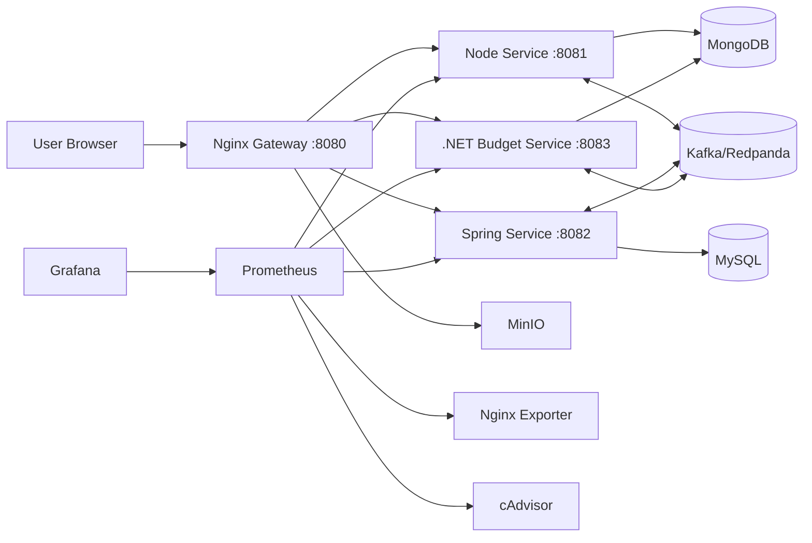
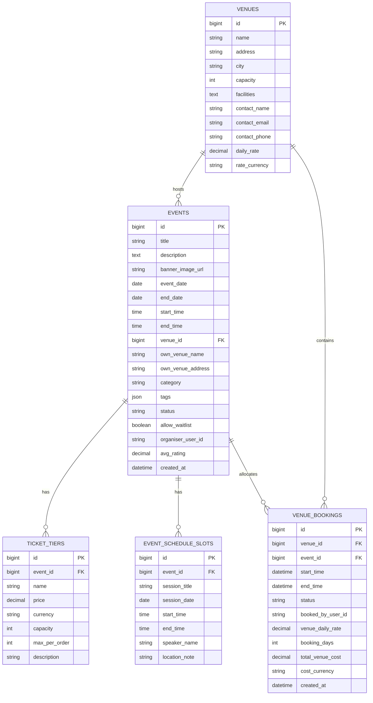
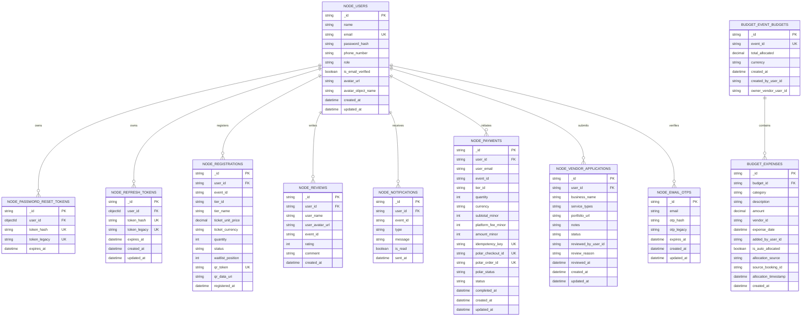
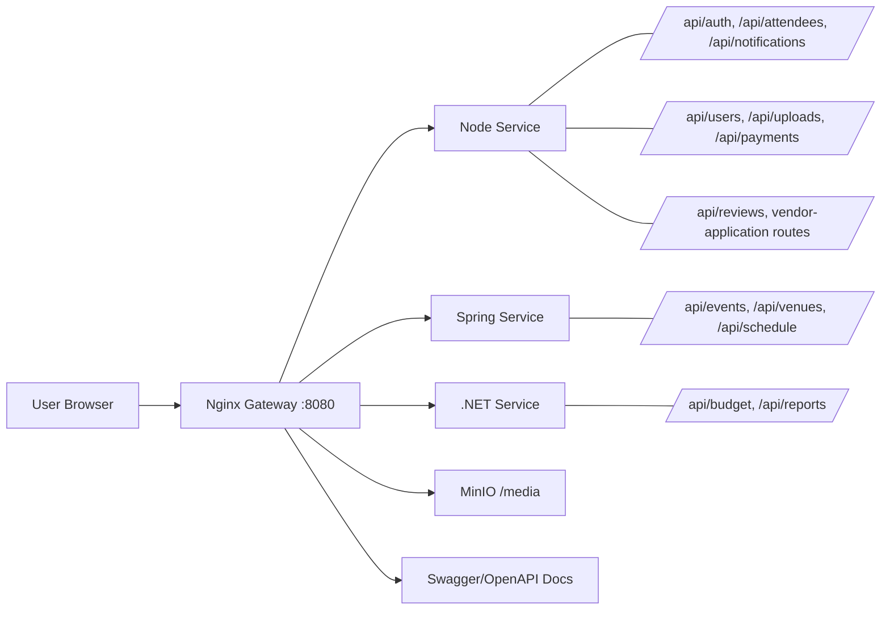

<div align="center">

# EventZen - Capstone Project

**A polyglot event management platform built as a microservices system.**

React · Node.js · Spring Boot · ASP.NET Core · Nginx Gateway


[](https://react.dev/)
[](https://nodejs.org/)
[](https://spring.io/projects/spring-boot)
[](https://dotnet.microsoft.com/)
[](https://docs.docker.com/compose/)
[](https://www.vaultproject.io/)

</div>

---

<p align="center"><a href="https://drive.google.com/file/d/1CjpBdCHB2xJgyvgHp-Yk9cbHp54BzyKc/view?usp=sharing"><strong>Watch Demo</strong></a></p>

## Table of Contents

- [Quick Start](#quick-start)
- [Alternative Setup Paths](#alternative-setup-paths)
- [Required Secrets & API Keys](#required-secrets--api-keys)
- [Architecture](#architecture)
- [System Flow](#system-flow)
- [Database ER Diagrams](#database-er-diagrams)
- [Repository Structure](#repository-structure)
- [Runtime Ports & Services](#runtime-ports--services)
- [Monitoring](#monitoring)
- [API Docs & Testing](#api-docs--testing)
- [Local Development](#local-development)
- [API Routing Through Gateway](#api-routing-through-gateway)
- [Testing & Quality Gate](#testing--quality-gate)
- [Service Documentation](#service-documentation)
- [Tech Stack](#tech-stack)

---

> [!NOTE]
> On **Linux**, the setup scripts (`.ps1`) require **PowerShell 7+**. Install it via your package manager (e.g. `sudo snap install powershell --classic`) before proceeding.

## Quick Start

> [!IMPORTANT]
> **Quick start everything (Vault + secrets + application) without the setup hassle.**

> [!CAUTION]
> Before running quickstart, keep these values equal to avoid Spring/MySQL startup failures:
> - `.env` → `MYSQL_ROOT_PASSWORD`
> - `vault-secrets.local.json` → `MYSQL_ROOT_PASSWORD`
> - `vault-secrets.local.json` → `SPRING_DATASOURCE_PASSWORD`
>
> Also keep mirrored secrets identical:
> - `JWT_SECRET` = `JWT__Secret`
> - `INTERNAL_SERVICE_SECRET` = `Spring__InternalSecret` = `Node__InternalSecret`

**Step 1 — Create your local env file:**

```powershell
Copy-Item .env.example .env
```

Then confirm/edit key values in `.env`:

- `VAULT_ADDR`
- `VAULT_DOCKER_ADDR`
- `VAULT_KV_PATH=eventzen/ez-secrets`
- `MYSQL_ROOT_PASSWORD` (must match Vault secrets)

**Step 2 — Create your local secrets file:**

```powershell
Copy-Item .\vault-secrets.example.json .\vault-secrets.local.json
```

Then fill your real values (SMTP/Polar/etc.) in `vault-secrets.local.json` — make sure the following secrets match their mirrored keys exactly:

- `MYSQL_ROOT_PASSWORD` (Vault) = `MYSQL_ROOT_PASSWORD` (`.env`)
- `SPRING_DATASOURCE_PASSWORD` = `MYSQL_ROOT_PASSWORD`
- `JWT_SECRET` = `JWT__Secret`
- `INTERNAL_SERVICE_SECRET` = `Spring__InternalSecret` = `Node__InternalSecret`
- `MINIO_ACCESS_KEY` = `MINIO_ROOT_USER`, `MINIO_SECRET_KEY` = `MINIO_ROOT_PASSWORD`

**Step 3 — Start the stack:**

> [!IMPORTANT]
> **Run this to start the full EventZen stack:**
>
> ```powershell
> ./scripts/quickstart.ps1 -Detach
> ```

> [!TIP]
> **Windows only — if you hit an execution policy error**, run this in the same terminal first, then re-run `quickstart.ps1`:
> ```powershell
> Set-ExecutionPolicy -Scope Process -ExecutionPolicy Bypass
> ```
> This only affects the current terminal session and is safe to use.

---

If your network is unstable while pulling images, use:

```powershell
./scripts/quickstart.ps1 -Detach -ComposeRetryCount 4 -ComposeRetryDelaySeconds 15
```

What `quickstart.ps1` does for convenience:

- Creates `.env` from `.env.example` if missing
- Starts a local Vault dev container if needed
- Ensures the `secret/` KV v2 mount exists
- Runs `start-local.ps1` (uploads local secrets, generates wrapped token, starts compose)

> [!TIP]
> `quickstart.ps1` auto-resolves busy host ports before compose starts.
> If a configured host port is already in use, it updates `.env` to the next free port for:
> - `GATEWAY_HOST_PORT`, `MONGO_HOST_PORT`, `MYSQL_HOST_PORT`
> - `MINIO_API_HOST_PORT`, `MINIO_CONSOLE_HOST_PORT`
> - `KAFKA_HOST_PORT`, `PROMETHEUS_HOST_PORT`, `GRAFANA_HOST_PORT`
>
> It also updates `GATEWAY_HEALTH_URL` (and related localhost gateway URLs) to match the new gateway port.
> The same remap behavior is available in `start-local.ps1`.
> If you want strict fixed ports, run quickstart or start-local with `-SkipPortAutoResolve`.

Optional dev-only fallback (not recommended for full feature testing):

```powershell
./scripts/quickstart.ps1 -Detach -AllowGeneratedDevSecrets
```

Manual setup still works and is fully supported. If you prefer explicit control, use the step-by-step flow below.

---

## Alternative Setup Paths

> **Use [Quick Start](#quick-start) for the fastest local startup.**
> This section is for alternative/manual startup flows.
> For full details and troubleshooting, see [`GETTING_STARTED.md`](GETTING_STARTED.md).

### 1) Prerequisites

```powershell
docker --version
docker compose version
vault --version
curl.exe --version (optional)
```

> [!NOTE]
> All commands should return a version number. Install any missing tools before continuing.

> [!TIP]
> **Install Vault CLI quickly:**
> Windows: `winget install HashiCorp.Vault`
> Linux: `sudo apt-get install -y vault` (or see [`GETTING_STARTED.md`](GETTING_STARTED.md) for the full repo setup)

### 2) Create local env file

```powershell
Copy-Item .env.example .env
```

In `.env`, confirm these values:

| Variable | Notes |
|---|---|
| `VAULT_ADDR` | Your Vault server address |
| `VAULT_DOCKER_ADDR` | Container-reachable Vault URL |
| `VAULT_KV_MOUNT` | Set to `secret` |
| `VAULT_KV_PATH` | **Must be** `eventzen/ez-secrets` |
| `EZ_VAULT_WRAP_PATH` | Set to `auth/token/create` |

### 3) Vault setup — choose one

<details>
<summary><b>Option A:</b> Start local dev Vault in Docker</summary>

```powershell
docker run --name eventzen-vault -d \
  --cap-add=IPC_LOCK \
  -e VAULT_DEV_ROOT_TOKEN_ID=root-dev-token \
  -e VAULT_DEV_LISTEN_ADDRESS=0.0.0.0:8200 \
  -p 8200:8200 \
  hashicorp/vault:1.16
```

If the container already exists:

```powershell
docker start eventzen-vault
```

Then set CLI env:

```powershell
$env:VAULT_ADDR = "http://127.0.0.1:8200"
$env:VAULT_TOKEN = "root-dev-token"
```

</details>

<details>
<summary><b>Option B:</b> Use an existing / external Vault</summary>

- Set `.env` → `VAULT_ADDR` to your real Vault URL.
- Set `.env` → `VAULT_DOCKER_ADDR` to a container-reachable Vault URL.
- Set shell `VAULT_TOKEN` to a valid token for your secret path.

</details>

### 4) Vault sanity check

```powershell
vault status
vault secrets list
```

If `secret/` is missing:

```powershell
vault secrets enable -path=secret kv-v2
```

> [!IMPORTANT]
> Vault should be **unsealed** and the `secret/` mount must exist before continuing.

### 5) Prepare local secrets file

```powershell
Copy-Item .\vault-secrets.example.json .\vault-secrets.local.json
```

Edit `vault-secrets.local.json` with your real values.

> [!WARNING]
> Signing secrets (`JWT_SECRET`, `INTERNAL_SERVICE_SECRET`, `TOKEN_HASH_SECRET`) **must be strong** — at least 32 bytes / 64 characters. Short secrets will crash Spring Boot on startup. See [Required Secrets & API Keys](#required-secrets--api-keys) for the full key reference, including how to obtain Polar.sh and Gmail SMTP credentials.

`./scripts/start-local.ps1` now checks Vault path `secret/eventzen/ez-secrets` automatically:

- If `vault-secrets.local.json` exists, startup uploads it to Vault before compose (this updates the path to a new KV version).
- If the local file is missing, startup uses the existing hosted Vault path.
- If both are missing, startup fails with setup guidance.

This is implemented for convenience in local development, but the manual Vault CLI flow is still supported.

Optional manual load/verify (same behavior as before):

```powershell
vault kv put -mount=secret eventzen/ez-secrets @vault-secrets.local.json
vault kv get -mount=secret eventzen/ez-secrets
```

### 6) Start the stack

> [!WARNING]
> Each wrapped token is **single-use** — once consumed by startup, it cannot be reused. A fresh token must be generated before every `docker compose up`.

**Option A (recommended for convenience):** Use the helper script, which validates Vault secrets availability, generates a fresh wrapped token automatically, writes it to `.env`, starts compose, and clears the token afterwards:

```powershell
./scripts/start-local.ps1
```

**Option B (manual, still fully supported):** Generate a wrapped token yourself, then run compose:

```powershell
./scripts/generate-vault-wrapped-token.ps1 -UpdateEnv
docker compose up --build
```

### 7) Health check

```powershell
curl.exe -fsS $env:GATEWAY_HEALTH_URL
```

The app opens at the URL mapped by `GATEWAY_HOST_PORT` (default: **http://localhost:8080**).

Three demo users are seeded automatically on first startup by the `user-seed` container:

| Email | Role | Password |
|---|---|---|
| `admin@ez.local` | ADMIN | `Eventzen@2026!` |
| `vendor@ez.local` | VENDOR | `Eventzen@2026!` |
| `user@ez.local` | CUSTOMER | `Eventzen@2026!` |

### 8) Troubleshooting

<details>
<summary>Health check failed? Expand for quick debug steps.</summary>

```powershell
docker compose ps
docker compose logs --tail=120 nginx-gateway
docker compose logs --tail=120 node-service spring-service dotnet-service
```

If a Vault / token error appears:

```powershell
./scripts/generate-vault-wrapped-token.ps1 -UpdateEnv
./scripts/start-local.ps1
```

</details>

### 9) Stop safely

```powershell
docker compose down
```

Full local reset (**removes DB volumes**):

```powershell
docker compose down -v
```

---

## Required Secrets & API Keys

Before starting the stack, you must populate `vault-secrets.local.json` with real values.
Every key in `vault-secrets.example.json` must be present in Vault — missing or weak values will cause services to crash on startup.

> [!CAUTION]
> **Strong secrets are mandatory.** The Spring Boot service uses HMAC-SHA256 (`Keys.hmacShaKeyFor`) to verify JWTs. This requires `JWT_SECRET` to be **at least 32 bytes** (256 bits) when encoded as UTF-8. In practice, use a **64-character random string** (or a base64 string of 48+ random bytes) for all signing secrets. Short or weak secrets will cause an immediate startup failure.

### Generating strong secrets

Run one of these commands **three times** to generate separate values for `JWT_SECRET`, `INTERNAL_SERVICE_SECRET`, and `TOKEN_HASH_SECRET`:

**PowerShell (Windows/Linux):**
```powershell
[Convert]::ToBase64String((1..48 | ForEach-Object { Get-Random -Maximum 256 }))
```

**Bash (Linux/Mac):**
```bash
openssl rand -base64 48
```

### Vault secrets reference

| Key | What it is | How to get it |
|---|---|---|
| `JWT_SECRET` | Shared HMAC signing key for JWT access tokens. Used by Node.js (issuer), Spring Boot, and .NET (verifiers). | Generate a strong random string (64+ chars). **Must be identical** across all three services. |
| `JWT__Secret` | Same value as `JWT_SECRET`. .NET configuration binding uses `__` as the section separator. | Copy the exact same value from `JWT_SECRET`. |
| `INTERNAL_SERVICE_SECRET` | Bearer token for service-to-service internal API calls (Node to Spring, Spring to Node). | Generate a strong random string (64+ chars). |
| `Spring__InternalSecret` | Same value as `INTERNAL_SERVICE_SECRET`. Used by the .NET service to call Spring internal endpoints. | Copy the exact same value from `INTERNAL_SERVICE_SECRET`. |
| `Node__InternalSecret` | Same value as `INTERNAL_SERVICE_SECRET`. Used by the .NET service to call Node internal endpoints. | Copy the exact same value from `INTERNAL_SERVICE_SECRET`. |
| `TOKEN_HASH_SECRET` | HMAC key used by Node.js to hash OTP codes and password-reset tokens before storing them. | Generate a strong random string (64+ chars). |

### External service credentials

<details>
<summary><b>Gmail SMTP</b> — required for OTP email verification and notifications</summary>

| Key | Value |
|---|---|
| `SMTP_HOST` | `smtp.gmail.com` |
| `SMTP_USER` | Your Gmail address (e.g. `you@gmail.com`) |
| `SMTP_PASS` | A 16-character **Google App Password** (not your login password) |

**Setup steps:**
1. Use (or create) a Gmail account for `SMTP_USER`.
2. Enable **2-Step Verification** on that Google account.
3. Go to [App Passwords](https://myaccount.google.com/apppasswords).
4. Generate a new app password (select "Mail" and your device).
5. Copy the 16-character password into `SMTP_PASS`.

> [!WARNING]
> Regular Gmail passwords will not work — Google blocks SMTP login unless you use an App Password with 2FA enabled.

</details>

<details>
<summary><b>Polar.sh</b> — required for paid ticket checkout and invoices</summary>

| Key | Value |
|---|---|
| `POLAR_ACCESS_TOKEN` | A personal/org API access token from Polar |
| `POLAR_PRODUCT_ID` | The UUID of the product you create in Polar |

**Setup steps:**
1. Create an account at [polar.sh](https://polar.sh).
2. Switch to **Sandbox mode** (for development/testing).
3. Create an **Organization** if you haven't already.
4. Create a **Product** that represents the EventZen checkout item (e.g. "EventZen Ticket"). Copy its product ID.
5. Go to **Settings > Developers > Personal Access Tokens**.
6. Create a new access token with checkout/order permissions. Copy the token.
7. Set `POLAR_ACCESS_TOKEN` to the token and `POLAR_PRODUCT_ID` to the product UUID.

> [!NOTE]
> The `.env` file controls `POLAR_SERVER=sandbox` vs `production`. For local development, keep it set to `sandbox`.

</details>

<details>
<summary><b>Infrastructure passwords</b> — local dev defaults are fine</summary>

| Key | Default | Notes |
|---|---|---|
| `SPRING_DATASOURCE_PASSWORD` | — | Must match `MYSQL_ROOT_PASSWORD` in `.env` |
| `MYSQL_ROOT_PASSWORD` | — | Set in both `.env` and Vault; pick any strong value |
| `MINIO_ACCESS_KEY` | `minioadmin` | MinIO S3 access key |
| `MINIO_SECRET_KEY` | `minioadmin` | MinIO S3 secret key |
| `MINIO_ROOT_USER` | `minioadmin` | Must match `MINIO_ACCESS_KEY` |
| `MINIO_ROOT_PASSWORD` | `minioadmin` | Must match `MINIO_SECRET_KEY` |
| `GRAFANA_ADMIN_USER` | `admin` | Grafana dashboard login |
| `GRAFANA_ADMIN_PASSWORD` | `admin` | Grafana dashboard password |
| `TEST_USER_PASSWORD` | `Eventzen@2026!` | Password for the three seeded test users |

</details>

### Key alignment rules

> [!IMPORTANT]
> Several secrets must have **identical values** across their mirrored keys:
> - `JWT_SECRET` = `JWT__Secret`
> - `INTERNAL_SERVICE_SECRET` = `Spring__InternalSecret` = `Node__InternalSecret`
> - `SPRING_DATASOURCE_PASSWORD` = `MYSQL_ROOT_PASSWORD` (in `.env`)
> - `MINIO_ACCESS_KEY` = `MINIO_ROOT_USER`, `MINIO_SECRET_KEY` = `MINIO_ROOT_PASSWORD`
>
> Mismatched values will cause authentication failures or database connection errors.

---

## Architecture

| Layer | Technology | Purpose |
|---|---|---|
| **Frontend** | React + Vite | Single-page application |
| **Gateway** | Nginx | Reverse proxy & static file server |
| **Node Service** | Node.js 20 | Auth · Attendees · Notifications · Uploads · Payments · Reviews |
| **Spring Service** | Spring Boot 3 (Java 21) | Events · Venues · Schedules |
| **.NET Service** | ASP.NET Core (.NET 10) | Budgets · Financial Reports |
| **MongoDB** | v7 | Node + .NET domain data |
| **MySQL** | v8 | Spring domain data |
| **Redpanda** | Kafka API | Event-driven messaging bus |
| **MinIO** | S3-compatible | Object storage for media |
| **Monitoring** | Prometheus + Grafana | Health & metrics dashboards |
| **Secrets** | HashiCorp Vault | Centralized secret management |

---

## System Flow



---

## Database ER Diagrams

<details>
<summary>MySQL ERD — Spring Domain</summary>



</details>

<details>
<summary>MongoDB ERD — Node + Budget Domains</summary>



</details>

---

## Repository Structure

```
.
├── Capstone.sln                                         # Solution entry
├── client/                                              # React + Vite frontend
├── docs/                                                # Hero image + Mermaid diagrams
├── mydocs/                                              # Team docs (endpoints, runbooks, UML)
├── server/
│   ├── backend-node/                                    # Node.js — auth / attendees / notifications
│   ├── backend-spring/                                  # Spring Boot — events / venues / schedule
│   └── backend-dotnet/                                  # ASP.NET Core — budget / reporting
├── nginx/                                               # Gateway Dockerfile + routing config
├── monitoring/                                          # Prometheus + Grafana config
├── scripts/                                             # Quality gate & utility scripts
├── eventzen-docker/                                     # Docker environment notes
├── docker-compose.yml                                   # Full local stack
├── EventZen_Full_Application.postman_collection.json    # Root API test collection
├── .env.example                                         # Environment variables template
├── GETTING_STARTED.md                                   # Full setup guide
└── vault-secrets.example.json                           # Vault secrets template
```

---

## Runtime Ports & Services

### Public Endpoints

| Endpoint | URL |
|---|---|
| App entry point | http://localhost:${GATEWAY_HOST_PORT} (default `8080`) |
| Gateway health | http://localhost:${GATEWAY_HOST_PORT}/health |
| Swagger UI | http://localhost:${GATEWAY_HOST_PORT}/swagger/ |
| Aggregated OpenAPI | http://localhost:${GATEWAY_HOST_PORT}/openapi/eventzen-aggregated.yaml |

### Internal Service Ports (Docker network)

| Service | Port |
|---|---|
| Node service | `8081` |
| Spring service | `8082` |
| .NET service | `8083` |

### Host-Exposed Infra Ports (tooling only)

| Service | Default Port | `.env` Override |
|---|---|---|
| MongoDB | `27018` | `MONGO_HOST_PORT` |
| MySQL | `3307` | `MYSQL_HOST_PORT` |
| MinIO API | `9000` | `MINIO_API_HOST_PORT` |
| MinIO Console | `9001` | `MINIO_CONSOLE_HOST_PORT` |
| Kafka external | `9094` | `KAFKA_HOST_PORT` |
| Prometheus UI | `9090` | `PROMETHEUS_HOST_PORT` |
| Grafana UI | `3000` | `GRAFANA_HOST_PORT` |

> [!NOTE]
> The public gateway port is controlled by `GATEWAY_HOST_PORT` (default `8080`) and may be auto-remapped by startup scripts when busy. Internal service ports (`8081`/`8082`/`8083`) stay stable for service-to-service URLs and health checks.

---

## Monitoring

Prometheus and Grafana are included in Docker Compose for full-stack observability.

| Dashboard | URL | Credentials |
|---|---|---|
| Prometheus | http://127.0.0.1:9090 | — |
| Grafana | http://127.0.0.1:3000 | `.env` → `GRAFANA_ADMIN_USER` / `GRAFANA_ADMIN_PASSWORD` |

**Monitored targets:**

| Target | Metrics Endpoint |
|---|---|
| Node service | `/metrics` |
| Spring service | `/actuator/prometheus` |
| .NET service | `/metrics` |
| Nginx exporter | built-in |
| cAdvisor | container metrics |
| MongoDB exporter | built-in |
| MySQL exporter | built-in |
| Kafka exporter | built-in |
| MinIO | native metrics |

> See [`monitoring/README.md`](monitoring/README.md) for full details.

---

## API Docs & Testing

| Resource | Location |
|---|---|
| Swagger UI | http://localhost:${GATEWAY_HOST_PORT}/swagger/ |
| Aggregated OpenAPI spec | http://localhost:${GATEWAY_HOST_PORT}/openapi/eventzen-aggregated.yaml |
| Postman collection | `EventZen_Full_Application.postman_collection.json` |
| Endpoint inventory | [`docs/Endpoints.md`](docs/Endpoints.md) |

> [!TIP]
> **Postman quick start:** Set the `baseUrl` variable to `http://localhost:<GATEWAY_HOST_PORT>` (default `8080`). The collection includes auth, events, attendees, payments, and budget/report flows.

---

## Local Development

> Use this mode to run services **individually** outside of Docker Compose.

<details>
<summary>Frontend</summary>

```bash
cd client
npm install
npm run dev
```

</details>

<details>
<summary>Node Service</summary>

```bash
cd server/backend-node
npm install
npm run dev
```

</details>

<details>
<summary>Spring Service</summary>

```bash
cd server/backend-spring
mvn spring-boot:run
```

</details>

<details>
<summary>.NET Service</summary>

```bash
cd server/backend-dotnet/EventZen.Budget
dotnet restore
dotnet run
```

</details>

---

## API Routing Through Gateway

| Route Pattern | Service |
|---|---|
| `/api/auth`, `/api/attendees`, `/api/notifications`, `/api/users`, `/api/uploads`, `/api/payments` | Node |
| `/api/reviews`, `/api/vendor-applications`, `/api/admin/vendor-applications` | Node |
| `/api/events`, `/api/venues`, `/api/schedule` | Spring |
| `/api/budget`, `/api/reports` | .NET |
| `/media` | MinIO |
| `/swagger/`, `/openapi/eventzen-aggregated.yaml` | Static docs (gateway) |
| All other routes | React SPA |

### Gateway Route Map



> [!IMPORTANT]
> **Cross-service event cancellation:** When an admin changes an event status to `CANCELLED` (or a non-draft event is deleted), the Spring service triggers attendee registration cancellation in the Node service — keeping event state and attendee/ticket state consistent across services.

---

## Testing & Quality Gate

Run the repository-wide quality gate from the project root:

```powershell
./scripts/run_quality_gate.ps1
```

**What it runs:**

| Check | Description |
|---|---|
| Node unit tests | Backend-node test suite |
| Kafka integration tests | Optional — event-driven flow tests |
| Spring tests | Backend-spring test suite |
| .NET tests | Backend-dotnet test suite |
| Client lint | ESLint on the frontend |
| Client build | Production build verification |

To skip Kafka integration checks:

```powershell
./scripts/run_quality_gate.ps1 -WithKafkaIntegration:$false
```

---

## Service Documentation

| Service | README | Testing Guide |
|---|---|---|
| Node | [`server/backend-node/README.md`](server/backend-node/README.md) | — |
| Spring | [`server/backend-spring/README.md`](server/backend-spring/README.md) | [`TESTING.md`](server/backend-spring/TESTING.md) |
| .NET | [`server/backend-dotnet/README.md`](server/backend-dotnet/README.md) | [`TESTING.md`](server/backend-dotnet/TESTING.md) |

---

## Tech Stack

<div align="center">

| Technology | Version |
|---|---|
| React | 19 |
| Vite | 8 |
| Node.js | 20 |
| Spring Boot | 3 (Java 21) |
| ASP.NET Core | .NET 10 |
| MongoDB | 7 |
| MySQL | 8 |
| Redpanda | Kafka API |
| MinIO | S3-compatible |
| Nginx | Gateway |
| HashiCorp Vault | Secrets |
| Prometheus + Grafana | Monitoring |

</div>
