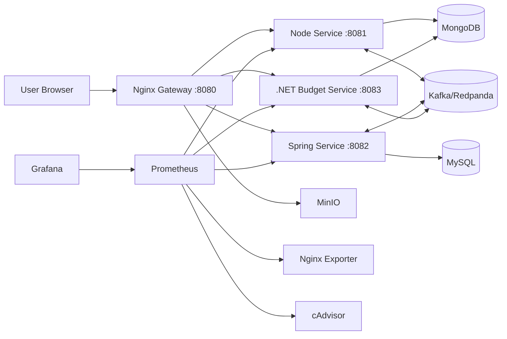
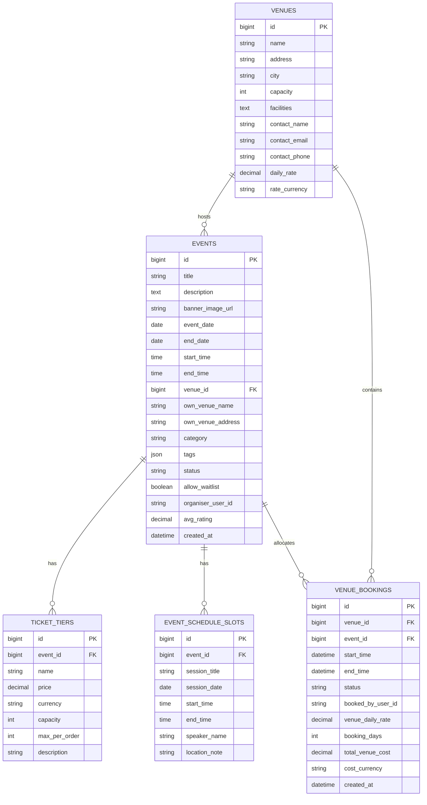
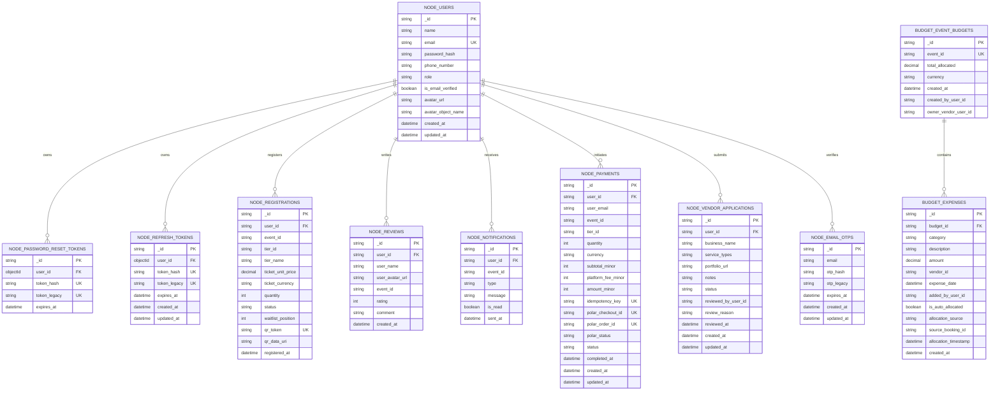

# EventZen

EventZen is a polyglot event management platform built as a microservices system.
It combines a React frontend with Node.js, Spring Boot, and ASP.NET Core services
behind a single Nginx gateway.

## Architecture

- Frontend: React + Vite
- API Gateway: Nginx
- Backend services:
	- Node.js service for auth, attendees, notifications, uploads
	- Spring Boot service for events, venues, schedules
	- ASP.NET Core service for budgets and financial reports
- Data + infra:
	- MongoDB (Node and .NET domains)
	- MySQL (Spring domain)
	- Redpanda/Kafka (event-driven messaging)
	- MinIO (object storage for media)
	- Prometheus + Grafana (health/metrics monitoring)

## Request Flow



## Mermaid Diagrams

<details>
<summary>MySQL ERD (Spring Domain)</summary>



</details>

<details>
<summary>MongoDB ERD (Node + Budget Domains)</summary>



</details>

## Repository Structure

```text
.
├─ client/                 # React + Vite frontend
├─ server/
│  ├─ backend-node/        # Node.js auth/attendees/notifications
│  ├─ backend-spring/      # Spring Boot events/venues/schedule
│  └─ backend-dotnet/      # ASP.NET Core budget/reporting
├─ nginx/                  # Gateway Dockerfile + Nginx routing config
├─ monitoring/             # Prometheus + Grafana dashboards/config
├─ scripts/                # Cross-service quality gate and utilities
├─ eventzen-docker/        # Docker environment notes
├─ mydocs/                 # Project docs (ERD/endpoints)
├─ docker-compose.yml      # Full local stack (frontend + all backends + infra)
├─ .env.example            # Required environment variables template
├─ GETTING_STARTED.md      # Full setup guide
└─ vault-secrets.example.json
```

## What Runs Where

- Public entry point: http://localhost:8080
- Gateway health: http://localhost:8080/health
- Internal backend container ports (Docker network only):
	- Node service: 8081
	- Spring service: 8082
	- .NET service: 8083
- Local host-exposed infra ports (for tooling only):
	- MongoDB: 27018
	- MySQL: 3307
	- MinIO API: 9000
	- MinIO Console: 9001
	- Kafka external: 9094
	- Prometheus UI: 9090 (localhost only)
	- Grafana UI: 3000 (localhost only)

Port configuration policy:

- Public gateway port is intentionally fixed to 8080 in Compose.
- Infra/tooling host ports are configurable in .env via:
	- MONGO_HOST_PORT
	- MYSQL_HOST_PORT
	- MINIO_API_HOST_PORT
	- MINIO_CONSOLE_HOST_PORT
	- KAFKA_HOST_PORT
	- PROMETHEUS_HOST_PORT
	- GRAFANA_HOST_PORT
- Internal service ports (8081/8082/8083) are kept stable for service-to-service URLs and health checks.

## Monitoring

Prometheus and Grafana are included in Docker Compose for application and infrastructure monitoring.

- Prometheus: `http://127.0.0.1:9090`
- Grafana: `http://127.0.0.1:3000`
- Grafana default credentials are read from `.env`:
	- `GRAFANA_ADMIN_USER`
	- `GRAFANA_ADMIN_PASSWORD`

Monitored targets include:

- Node service (`/metrics`)
- Spring service (`/actuator/prometheus`)
- .NET service (`/metrics`)
- Nginx exporter
- cAdvisor (container metrics)
- MongoDB exporter
- MySQL exporter
- Kafka exporter
- MinIO native metrics endpoint

See `monitoring/README.md` for details.

## Quick Start (Docker, Recommended)

If you want a full beginner-friendly walkthrough, follow `GETTING_STARTED.md`.

### 1. Prepare environment

```bash
cp .env.example .env
```

On Windows PowerShell:

```powershell
Copy-Item .env.example .env
```

Edit `.env` and set at least:

- Vault connectivity variables (`VAULT_ADDR`, `VAULT_*`)
- Container-side Vault address (`VAULT_DOCKER_ADDR`) for Docker networking
- Wrapped SecretID placeholder (`VAULT_WRAPPED_SECRET_ID`)
- Infra secrets still used by third-party images (`MYSQL_ROOT_PASSWORD`, `MINIO_ROOT_PASSWORD`, `GRAFANA_ADMIN_PASSWORD`)

Use `vault-secrets.example.json` as your key template and create/update these values directly in the Vault UI at `secret/eventzen/ez-secrets`.

Generate one wrapped token in your Vault client for that secret access scope, then paste it into `.env`:

- `VAULT_WRAPPED_SECRET_ID=<wrapped-token>`

Generate a fresh wrapped token before each `docker compose up` because wrapped tokens are single-use and short-lived.

### 2. Build and start everything

```bash
docker compose up --build
```

Or use the one-command helper (generates a fresh wrapped token automatically):

```powershell
./scripts/start-local.ps1
```

This command builds and installs dependencies for all services, including the
frontend build that is bundled into the Nginx gateway image.

On startup, Compose also runs an idempotent `user-seed` job that upserts default
test users into MongoDB, so no manual seeding step is required.

Default test users:

- `admin@ez.local` (ADMIN)
- `vendor@ez.local` (VENDOR)
- `user@ez.local` (CUSTOMER)
- Password for all: `Eventzen@2026!` (override with `TEST_USER_PASSWORD`)

If you need to re-run seeding manually:

```bash
docker compose run --rm user-seed
```

### 3. Verify health

```bash
curl http://localhost:8080/health
```

Expected response: JSON status from `nginx-gateway`.

### 4. Stop stack

```bash
docker compose down
```

Remove containers and volumes:

```bash
docker compose down -v
```

`docker compose down -v` removes persisted databases; next startup will seed
the default users again.

## Local Development (Without Full Compose)

Use this mode if you want to run services individually.

### Frontend

```bash
cd client
npm install
npm run dev
```

### Node service

```bash
cd server/backend-node
npm install
npm run dev
```

### Spring service

```bash
cd server/backend-spring
mvn spring-boot:run
```

### .NET service

```bash
cd server/backend-dotnet/EventZen.Budget
dotnet restore
dotnet run
```

## API Routing Through Gateway

The gateway forwards requests as follows:

- `/api/auth`, `/api/attendees`, `/api/notifications`, `/api/users`, `/api/uploads`, `/api/payments`, vendor-application routes -> Node service
- `/api/events`, `/api/venues`, `/api/schedule` -> Spring service
- `/api/budget`, `/api/reports` -> .NET service
- `/media` -> MinIO
- Non-API routes -> React SPA static build

Cancellation behavior:

- When an admin changes an event status to `CANCELLED` (or a non-draft event is deleted), Spring now triggers attendee registration cancellation in the Node service.
- This keeps event state and attendee/ticket state consistent across services.

## Testing and Quality Gate

Run the repository-wide quality gate from project root:

```powershell
./scripts/run_quality_gate.ps1
```

What it runs:

- Node unit tests
- Optional Node Kafka integration tests
- Spring tests
- .NET tests
- Client lint
- Client production build

To skip Kafka integration checks:

```powershell
./scripts/run_quality_gate.ps1 -WithKafkaIntegration:$false
```

## Service Documentation

- Node service docs: `server/backend-node/README.md`
- Spring service docs: `server/backend-spring/README.md`
- .NET service docs: `server/backend-dotnet/README.md`
- Spring testing guide: `server/backend-spring/TESTING.md`
- .NET testing guide: `server/backend-dotnet/TESTING.md`

## Tech Stack

- React 19 + Vite 8
- Node.js 20
- Spring Boot 3 (Java 21)
- ASP.NET Core (.NET 10 image in Dockerfile)
- MongoDB 7 + MySQL 8
- Redpanda (Kafka API)
- MinIO
- Nginx